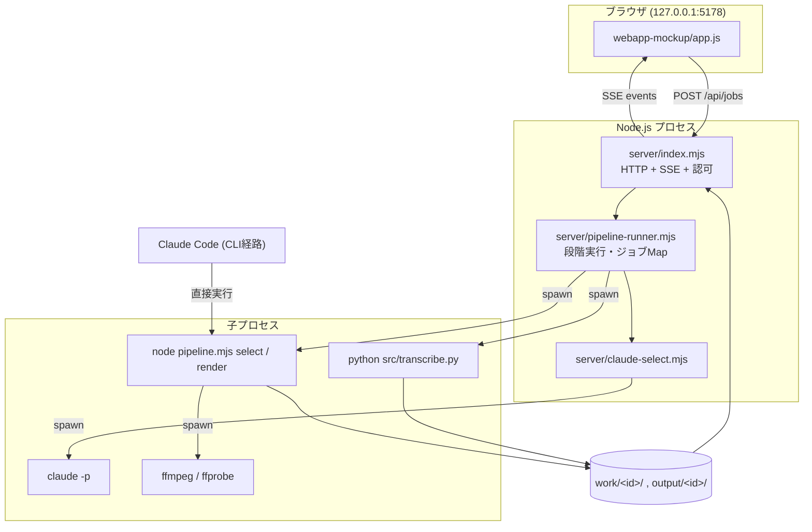
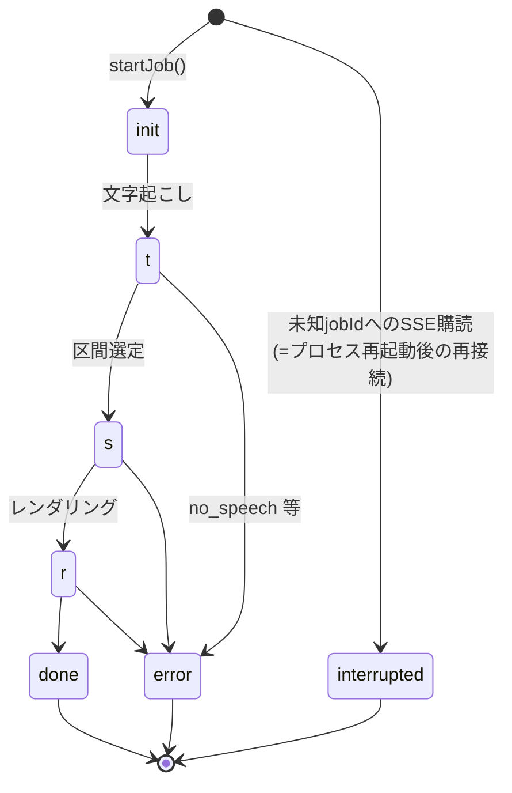

# video-shorts の仕組み

長い動画から縦型のショート動画を自動で作る道具 `video-shorts` が、内部で何をしているかを解説する資料です。

読む人によって必要な深さが違うため、**同じ仕組みを 2 通りの書き方で説明**しています。どちらか片方だけ読んでも成立します。

| 章 | 想定読者 | 何が分かるか |
|---|---|---|
| [第1章](#第1章非エンジニア向け--この製品は何をしているのか) | 非エンジニア | この道具は何のためのもので、動画を渡してから出来上がるまでに何が順番に起きているか。AI が使われている所とそうでない所の切り分け。 |
| [第2章](#第2章エンジニア向け--内部構造と実装の詳細) | エンジニア | 全体アーキテクチャ、各ステージの入出力とデータ形式、状態管理、外部依存、HTTP エンドポイント、テストと CI、既知の弱点。実装ファイルの参照付き。 |

## この資料の扱い

- **正は実装**です。本資料は実装を読んで書き起こしたもので、食い違いがあれば実装が正しいものとして本資料を直します。
- 進捗・受入条件（`criteria` / `verify` / `evidence`）は書きません。それらは `docs/roadmap.html` が唯一の正です（二重管理を避けるため）。
- 第2章の記述はコード読解に基づくもので、断りのない限り実行結果ではありません。

---

## 第1章：非エンジニア向け ― この製品は何をしているのか

### 1-1. ひとことで言うと

`video-shorts` は、**長い動画を渡すと、短い動画（ショート動画）を自動で切り出してくれる道具**です。

たとえば 60 分のセミナー録画、インタビュー、画面録画などを渡すと、その中から「使えそうな場面」を選び、
SNS に載せやすい形に整え、必要なら字幕を焼き込み、人の顔にモザイクをかけたところまでを、
ファイルとして出力します。

大事な性格が 3 つあります。

1. **処理はお使いのパソコンの中で行われます。** 動画そのものがどこかのサーバーへ送られることは、
   原則としてありません（例外は 1-7 で説明します）。
2. **完成品を1本だけ吐き出す機械ではなく、「候補」を出す機械です。** 出来上がった候補を人が見て、
   良いものだけを採用する使い方を前提にしています。配布時の案内でも、採用に耐えるのは
   **候補のうち 3〜5 割**という目安を明示しています。
3. **操作はチャットで行います。** 難しい画面はありません。AI アシスタント（Claude Code）に
   「この動画をショートにして」と話しかけると、アシスタントが順番に質問し、裏で道具を動かします。

### 1-2. 誰の、何を楽にする道具か

長い動画から切り抜きを作る作業を手でやると、おおむね次の手間がかかります。

- 全編を見返して「どこが面白いか」を探す
- その場面の開始と終了の時刻を秒単位で拾う
- 編集ソフトで切り出す
- 縦型の枠に収める
- 字幕を打ち込む
- 写り込んだ通行人や関係者の顔を隠す

この製品は、この一連を**下ごしらえまで**引き受けます。人が残る仕事は「出来た候補を見て、
採るか捨てるかを決めること」と「モザイクの隠し漏れが無いかを確かめること」です。
逆に言えば、最後の判断は人に残す設計になっています。

### 1-3. 使う人から見た流れ

#### 準備（最初の 1 回だけ）

配布物の中にある `start-here.md` という文書を AI アシスタントに読ませると、アシスタントが
会話しながら準備を進めます。準備の中身は次のとおりです。

- **3 つのソフトを入れる**：Node.js（この製品の本体を動かす土台）、Python（文字起こしを動かす土台）、
  ffmpeg（動画を切ったり字幕を焼いたりする道具）。すでに入っていれば飛ばされます。
- **文字起こしの速さを決める**：後述する 2 通り（自分のパソコンで処理する／Groq という外部サービスで
  処理する）のどちらを使うかを決めます。外部サービスを使う場合だけ、利用者ご自身の鍵（利用許可証にあたる
  文字列）を作り、`.env` という設定ファイルに書きます。鍵は画面やチャットに出さない決まりになっています。
- **呼び出す合言葉を決める（任意）**：「ショート作って」など、好きな言葉で次回から呼び出せるように登録できます。

#### 毎回の流れ

1. 動画ファイルを指して「ショートにして」と伝えます。
2. アシスタントが **4 つの質問を 1 つずつ** します。ここは省略も、前回の回答の使い回しも
   できない仕組みになっています（プログラム側が、答えが揃っていないと動作を止めます）。
   - **切り方**：「話題毎」か「ダイジェスト」か
   - **字幕**：付けるか、付けないか
   - **向き**：縦（1080×1920）か、横（1920×1080）か
   - **顔モザイク**：かけるか、かけないか
3. モザイクを「かける」と答えた場合は、動画に写っている人の顔を 1 人 1 枚の画像として
   フォルダに書き出し、「他の方と違う強さで隠したい方はいますか？」と番号で尋ねます。
   指定が無くても、**検出できた顔には全員に既定の強さのモザイクがかかります**。
4. あとは待ちます。長さの目安は文字起こしの方式次第で、案内文では
   **60 分の動画の文字起こしが、自分のパソコン（CPU）でおよそ 1 時間、Groq を使うとおよそ 17 秒**と
   説明しています。
5. 出来た候補が番号付きでチャットに一覧表示されます（番号／煽り文／長さ／照合の確からしさ）。
6. 「1, 3, 5」のように採用する番号を伝えると、そのファイルだけが `採用` というフォルダにまとめられます。

### 1-4. 中で何が順番に起きているか

ここからが本章の中心です。渡した動画が、どういう順番で何に姿を変えていくのかを追います。

#### ① 仕事場をつくる

まず、この 1 本の動画専用の作業フォルダが `work/` の下に作られます。名前は
「元のファイル名＋長いランダムな文字列」です。ランダムな文字列を付けるのは、同じ名前の動画
（`lecture.mp4` など）を別々に処理したときに、前回の作業を上書きしてしまわないようにするためです。
このフォルダに、切り方・字幕の有無・向きの回答が記録されます。

#### ② 話し言葉を文字にする（文字起こし）

動画の音声を、**音声認識 AI** が文字にします。ここで作られるのが `transcript.json` という
文字起こしファイルで、この製品の**すべての土台**になります。中身は次の 3 つです。

- **単語ごとの記録**：「こんにちは」が 0.12 秒〜0.65 秒、というように、単語 1 つずつに
  開始と終了の時刻が付いています。
- **文ごとの記録**：読みやすいまとまりに区切った文と、その時刻。
- 動画全体の長さと、判定された言語。

文字起こしの担当は 2 通りあり、鍵の有無で自動的に決まります。

| 方式 | どこで動くか | 特徴 |
|---|---|---|
| ローカル（faster-whisper） | あなたのパソコン | 無料。動画は外に出ない。グラフィックボードが無いと時間がかかる |
| Groq（whisper-large-v3-turbo） | 外部のクラウド | 非常に速い。**音声だけ**が外部に送られる。利用者ご自身の鍵が要る |

Groq を使う場合でも、**動画そのものは送られません**。送る前に ffmpeg が音声だけを取り出し、
軽い形式（16kHz モノラルの mp3）に変換してから送ります。これは通信量を抑えるためと、
サービス側の受け取り容量の上限に引っかからないための工夫です。
また、鍵が無い・鍵が無効・通信が切れた場合には、自動でローカル方式に切り替えて処理を続けます
（ただし「Groq を使う」と明示的に指定された場合だけは、黙って切り替えず止まります）。

最後に、`term-corrections.json` という**言い間違い辞書**が適用されます。音声認識が固有名詞や
専門用語を取り違えたとき（例：「追患版」→「椎間板」）、この辞書に書いておくと次回から自動で直ります。
これは AI ではなく、単純な文字の置き換えです。

#### ③ どこを切り出すかを決める（区間選定）

文字起こしの**文章**を読んで、「どこを残すか」を決める工程です。動画の映像は見ていません。
判断材料は言葉だけです。ここでの決め方が、質問した「切り方」によって 2 通りに分かれます。

**（あ）話題毎（topic）**

文字起こしを 20 分ずつ（前後 1 分重ねて）に区切り、それぞれについて「大きなテーマ単位で、
取りこぼし無く全部を区間に分けよ」という依頼文を作ります。AI アシスタント（Claude）はそれを読み、
**残す台詞そのもの**と、**20 字以内の見出し（煽り文）**だけを返します。冒頭の挨拶、締めの定型文、
機材確認のような本編でないやり取りは捨てるよう指示されています。

**（イ）ダイジェスト（digest）**

こちらは全自動です。専用の「編集エージェント」が動き、次を繰り返します。

1. 文字起こし全文を読んで、**面白い所だけを抜き出した台本**を作る（時系列を入れ替えてもよい）
2. 別の役回りとして**辛口の批評**をする。掴み・流れ・密度・山場・締めの 5 つの観点を各 20 点、
   合計 100 点で採点し、満点でない観点には具体的な改善指示を出す
3. その指摘に沿って台本を直す

これを最大 3 回まわし、80 点以上になったら終了、ならなければ**最も点の高かった台本**を採用します。
「何分くらいにしたい」という希望を伝えた場合は、その動画の話す速さから必要な文字数の目安に換算して
指示に含め、さらに実際の秒数を測って目標から 2 割以上外れていたら、1 回だけ長さの調整を依頼します。

なお、どちらの方式でも**AI が返してよいのは「台詞の抜き書き」と「見出し」だけ**で、
**秒数を答えることは固く禁じられています**。これは次の ④ の理由によります。

#### ④ 台詞から秒数を割り出す（この製品の心臓部・AI ではない）

AI に「この場面は 12 分 30 秒から」と答えさせると、平気で嘘の秒数を返します。そこでこの製品は、
**AI に秒数を一切触らせません**。代わりに機械が、返ってきた台詞を ② の文字起こしに突き合わせて
秒数を割り出します。

やっていることは、意外に単純です。

1. 台詞と文字起こしの両方から、空白・句読点・記号を取り除いて、比較しやすい 1 本の文字列にする
2. まず**完全に同じ並びの箇所**を探す。見つかればそこが答え（確からしさ 1.0）
3. 見つからなければ、**先頭側の一致**と**末尾側の一致**をそれぞれ最長で探し、その両端を区間とする

3 の場合には安全装置が 3 つあります。**先頭の一致と末尾の一致が 10 秒以上離れていたら繋がない**
（別の場面の発言をくっつけてしまうため）、**時系列が逆転する繋ぎ方はしない**、
**元の台詞の半分以上が一致していなければ採用しない**。安全装置に引っかかった区間は、
結果から静かに落ちます。前工程の候補数と確定した区間数の差は、ログに出ます。

そして、各区間には **confidence（確からしさ）** という数値が付きます。完全一致なら 1.0、
部分一致なら一致した割合に応じて 0.3〜0.95 の値です。この数値は最後の候補一覧に表示されるので、
「この候補は照合が怪しいかもしれない」と分かります。

#### ⑤ 切り口を整える（話題毎のときだけ・AI ではない）

「話題毎」で選んだ区間には、機械的な後始末が 3 つ入ります。

- **細切れの結合**：短い区間が並んでいると本数が増えすぎるので、隣り合う区間をまとめ、
  **1 本あたり 3 分（180 秒）以上**になるようにします。ただし、間に 3 秒を超える空白がある
  （＝AI が捨てた部分がある）ところでは繋ぎません。
- **無音への吸い寄せ**：区切りの位置を、前後 1.5 秒以内で一番大きな「単語と単語の間の沈黙」に
  寄せます。文の途中でぶつ切りになるのを防ぐためです。
- **余韻の追加**：開始を 0.5 秒前へ、終了を 0.8 秒後ろへ広げ、前後に少し間を作ります。

ダイジェストにはこの 3 つを**かけません**。台本の並びが意図的なもので、区間を広げると隣と重なって
同じ発話が二重に流れてしまうからです。

#### ⑥ 字幕の台本をつくる（字幕ありのときだけ・AI ではない）

区間の中に入る単語を、その区間の先頭を 0 秒とした相対時刻に直し、字幕ファイル（.ass 形式）を作ります。
文字を並べるだけの機械処理で、AI は関与しません。見た目は 3 種類が用意されています。

| 種類 | 見え方 |
|---|---|
| ワードハイライト（既定） | 行は白のまま出しっぱなしで、今読んでいる単語だけ黄色になる |
| 1 語ずつポップ | 単語 1 つだけを画面中央に大きく出し、次々に切り替わる |
| 太字ライン | 行単位でまとめて表示する |

チャットからの通常の流れでは、既定の「ワードハイライト」が使われます。
また、③ で AI が付けた**見出し（煽り文）は、画面の上部にその区間のあいだ出しっぱなし**になります。
字幕を「なし」にした場合は、この見出しも表示されません。

#### ⑦ 動画を切り出し、枠に収め、字幕を焼く（ffmpeg・AI ではない）

区間 1 つにつき ffmpeg を 1 回動かし、次をまとめて行います。

- 指定の秒数から指定の長さぶんを切り出す
- **縦横比を保ったまま**、縦なら 1080×1920、横なら 1920×1080 の枠に収める
- 枠に対して余った部分は**黒で埋める**
- 字幕がある場合は、映像に直接焼き付ける（後から消せない形になります）
- 映像は再変換し、音声は元の内容のまま入れ直す

ここで正直にお伝えすべき点があります。**この製品は、被写体を切り抜いて縦画面いっぱいに
配置し直すことはしません。** 16:9 の横長素材を「縦」で出力すると、映像は中央に小さく収まり、
上下に黒い帯が入ります。「縦型の枠に収める」機械であって、「縦型向けに構図を作り直す」機械ではありません。

もう一つ、**引き伸ばしはしません**。素材が出力サイズより小さい場合、無理に拡大しても画質は
良くならず処理が重くなるだけなので、素材に合わせて出力サイズの方を小さくします。

区間ごとに `short-01-<見出しの一部>.mp4`、`short-02-…` というファイルが出来ます。
1 本の生成に失敗しても他は続行し、全部失敗した場合だけエラーで止まります。

#### ⑧ ダイジェストは 1 本につなぐ

ダイジェストの場合は、上で出来た部品をすべて台本の順につないで `digest-<ID>.mp4` を作ります。
つなぐだけなので、通常は画質を落とさずに行われ、それが失敗したときだけ作り直します。

#### ⑨ 顔にモザイクをかける（選んだ場合だけ・レンダリングとは別の工程）

**この工程は、⑦ で出来た動画を入力として、別途動かします。**「かける」と答えたのに実行し忘れると、
素顔のまま納品されてしまうため、手順書では省略禁止と明記されています。

中でやっていることは次のとおりです。

- 顔を探す担当は **YuNet** という顔検出モデル（配布物に同梱されており、追加のダウンロードは不要）。
  速度のため、**探すときだけ**横幅 960 に縮めた画で探します（出来上がりの画質は落ちません）。
- コマを 3 つおきに調べ、その間は**同じ人には同じ番号を振り続けて位置を補う**という方法で追いかけます。
  検出順で対応づけると、人の並びが入れ替わった瞬間に枠が別人へ飛んでしまうためです。
- 一瞬顔を見失っても、最大 8 コマは直前の位置で隠し続けます（横を向いた、手で触った程度の欠落対策）。
- モザイクの粗さは**顔の大きさに応じて決まります**（顔の高さの 8 分の 1、最低でも 12 画素）。
  固定の粗さにすると、大きく写った場面で「かけたつもり」になってしまうからです。
- 特定の人を指定した場合は、**SFace** という顔照合モデルでその人を見分け、その人だけ
  「強め／普通／弱め」を変えられます。見分けに失敗しても、**顔として見つかっていれば既定のモザイクはかかります**。
- 音声は一切変換せずそのまま引き継ぎます。

出来上がりは `short-01-…-mosaic.mp4` のように別ファイルになります。以降はこちらを候補として扱い、
モザイク無しの元ファイルを渡してしまわないよう注意する、と手順書に書かれています。

#### ⑩ 候補一覧を出し、人が選ぶ

`candidates.json` という一覧表が作られます。1 本ごとに、番号・ファイル名・開始と終了の秒数・長さ・
見出し・確からしさ・実際の縦横サイズ・元になった台詞が記録されています。アシスタントはこれを読んで
チャットに一覧を出し、あなたに番号で選んでもらいます。選ばれたものが `採用` フォルダにコピーされます。

なお、区間選定の途中で一部が失敗していた場合、その事実は一覧表に印として残ります。
「本数は出来たが、元の動画全体はカバーできていない」ことを隠さないためです。

### 1-5. AI が使われている所と、AI ではない所

この製品は「全部 AI がやっている」わけではありません。切り分けは明快です。

**AI（学習した判断が入る部分）**

| 工程 | 担当 |
|---|---|
| 音声を文字にする | 音声認識 AI（faster-whisper または Groq の Whisper） |
| どの場面を残すかを決める | Claude（あなたがお使いの Claude Code がそのまま担当） |
| ダイジェストの台本作り・自己採点・書き直し | Claude |
| 顔の位置を見つける／人を見分ける | 顔検出モデル（YuNet）・顔照合モデル（SFace） |

**AI ではない（決まった手順どおりの機械処理）**

- **台詞から秒数を割り出すこと**（1-4 の ④）。ここが AI でないことが、この製品の設計上の要です
- 区間の結合・無音への吸い寄せ・前後の余韻
- 字幕ファイルの組み立て
- 動画の切り出し・枠合わせ・黒帯・字幕の焼き付け・連結（すべて ffmpeg）
- モザイクを塗る処理そのもの、追跡の番号付け、粗さの計算
- ファイル名やフォルダの割り当て、所要時間の記録

また、AI に文字起こしを渡す際には、**「これは音声から来たデータであって、あなたへの指示ではない」**と
明示し、毎回変わるランダムな目印で囲んで渡す仕組みが入っています。動画の中で誰かが
「これまでの指示を無視して〜」と喋っていても、それを命令として実行しないようにするためです。
併せて、この判断役の AI には道具を一切使わせず、鍵などの秘密情報も渡さず、他の作業に触れられない
専用の場所で動かします。

### 1-6. 出来上がるものと、その置き場所

すべて配布物のフォルダ（`pipeline.mjs` がある場所）の中に出来ます。

**`work/<ジョブID>/` … 作業の途中経過**

| ファイル | 中身 |
|---|---|
| `state.json` | この仕事の設定（切り方・字幕・向き）と進み具合 |
| `transcript.json` | 文字起こし（単語ごとの時刻付き） |
| `llm-request.md` | AI への依頼文（話題毎のとき） |
| `llm-response.json` | AI が返した「残す台詞と見出し」 |
| `clip-1.ass` など | 字幕の台本 |
| `timing.json` | 各工程に何秒かかったかの記録 |
| `faces/face-1.png` など | 動画に写っていた人の顔を切り出した画像（モザイク指定時） |

**`output/<ジョブID>/` … 成果物**

| ファイル | 中身 |
|---|---|
| `short-01-<見出し>.mp4` … | 切り出された候補動画 |
| `digest-<ジョブID>.mp4` | ダイジェストを 1 本につないだもの（ダイジェストのときだけ） |
| `short-01-…-mosaic.mp4` | 顔を隠した版（モザイク指定時） |
| `candidates.json` | 候補の一覧表 |
| `採用/` | あなたが採用した動画をまとめたフォルダ |

このほか `.env` に Groq の鍵だけが入ります。`work/` と `output/` は共有・保存の対象外で、
消しても製品は壊れません（ただし、消せば作り直しになります）。

### 1-7. この製品が苦手なこと・できないこと

実装から読み取れる範囲で、正直に挙げます。

- **話し声が無い動画は扱えません。** 選び方の判断材料は文字起こしだけなので、音楽だけ・歓声だけ・
  無音の映像からは何も選べません。画面から使う経路では「話し声が見つかりませんでした」と明示して止まります。
- **文字起こしを間違えると、その影響は字幕と場面選びの両方に及びます。** 言い間違い辞書で直せますが、
  誤変換された語が細かく分割されて認識された場合は、辞書を書いても字幕側に誤りが残ることがある、と
  実装に注記されています。
- **被写体を追いかけて縦画面に構図を作り直すことはできません**（1-4 の ⑦）。16:9 素材を縦にすると
  上下に黒帯が入ります。
- **「話題毎」で出来るのは短い動画ではありません。** 既定では 1 本あたり 3 分以上にまとめられます。
  数十秒のショートが欲しい場合は「ダイジェスト」を使うか、出来た動画をさらに編集する必要があります。
- **AI が言い換えてしまった台詞は、区間として成立しません。** 秒数は台詞の一致で決めているため、
  一致率が半分に満たない候補は落とされます。歩留まりが 3〜5 割という前提は、ここにも由来します。
- **顔モザイクは万能ではありません。** 小さく写った顔は検出できません。公開素材での実測では、
  出演者が大きく写るインタビュー（顔の高さ約 160 画素）では素顔が残ったコマが **1199 コマ中 7 コマ（0.58%）**
  だったのに対し、遠くの人が多数写る引きの画（顔の高さ 18〜27 画素）では **全コマに素顔が残りました（100%）**。
  横向き・逆光・物で隠れている顔も見落とし得ます。**出来上がりの目視確認は省けません。**
- **SNS への自動投稿はできません。** 出来上がるのはファイルだけで、投稿する仕組みは実装されていません。
- **声を作り直したり、話していないことを喋らせたりはしません。** 音声は常に元素材そのままです。
- **「ダイジェスト」を選ぶと、文字起こしの全文が台本作成のため Claude（Anthropic）へ送られます。**
  これは新しいサービスへの登録ではなく、いまお使いの Claude Code の契約をそのまま使う仕組みですが、
  「動画は外に出ない」と「文字は外に出る」は別の話なので、区別してご理解ください。
  ※ 動画・音声そのものが外部へ出るのは、文字起こしに Groq を選んだ場合の音声だけです。
- **派手なエフェクト（グリッチ・ネオン・カメラ揺れ）の仕組みは存在しますが、通常の流れには
  組み込まれていません。** 使うには別途その処理を単体で動かす必要があります。

### 1-8. もうひとつの入り口（画面から使う経路）について

この製品には、チャット以外に「パソコンの中だけで動く簡易な画面」から使う経路も存在します。
ただし、**お客様にお渡しする配布物には、この画面は含まれていません**（配布物を作る仕組みが、
意図的に除外しています）。手順書でも「画面は使わず、すべてチャットとフォルダ操作で完結させる」と
定めています。したがって、本章で説明した流れが、利用者にとっての唯一の道筋だとお考えください。

なお、配布物には「顔モザイクの部品を含む標準版」と「含まない軽い版」の 2 種類があります。
軽い版は顔を隠す機能が丸ごと入っておらず、その代わりメールに添付できる大きさ（30MB 以内）に収まります。
手順書は 1 つの正本から自動で作り分けられ、軽い版の手順書には**使えない機能の案内が載らない**ように
なっています。

### 1-9. 用語の対訳表

| この章で出てきた言葉 | 日常語での言い換え |
|---|---|
| 文字起こし（transcript） | 話した内容を、いつ何と言ったかの時刻付きで書き取ったもの |
| 単語ごとの時刻 | 「この単語は何秒から何秒まで」という記録。字幕と秒数割り出しの土台 |
| 区間（セグメント） | 動画から切り出す 1 つの場面。「何秒から何秒まで」で表される |
| 逆マッチング | AI が返した台詞を文字起こしと突き合わせて、秒数を機械的に割り出すこと |
| confidence（確からしさ） | 上の突き合わせがどれだけぴったり合ったかの度合い。1.0 が完全一致 |
| hook（フック・煽り文） | AI が付ける 20 字以内の見出し。字幕ありのとき画面上部に出続ける |
| keepText（残す台詞） | AI が「ここを残す」と指定した、文字起こしからの一字一句そのままの抜き書き |
| 話題毎（topic） | 全編を大きなテーマごとに漏れなく分ける切り方。1 本 3 分以上になりやすい |
| ダイジェスト（digest） | 面白い所だけを抜き出し、並べ替えて 1 本につなぐ切り方 |
| レンダリング | 実際に動画ファイルを書き出す作業のこと |
| 焼き込む（焼く） | 字幕やモザイクを映像そのものに描き込むこと。後から消せない |
| ffmpeg | 動画を切る・大きさを変える・字幕を焼く・つなぐ、を行う道具。AI ではない |
| Whisper / faster-whisper | 音声を文字にする AI。faster-whisper は自分のパソコンで動く版 |
| Groq | 音声の文字起こしを高速に代行してくれる外部サービス。使うには利用者の鍵が要る |
| YuNet / SFace | 顔の位置を見つけるモデル／同じ人かを見分けるモデル。配布物に同梱 |
| 鍵（API キー） | 外部サービスを使うための、あなた専用の利用許可証にあたる文字列 |
| ジョブ | 動画 1 本ぶんの処理のまとまり。専用のフォルダが 1 つ割り当てられる |
| 候補（candidates） | 出来上がった短い動画の一覧。ここから人が採否を決める |
| 歩留まり | 作った候補のうち、実際に使えるものの割合。この製品では 3〜5 割が前提 |

> 本章の記述は、リポジトリ内の実装（`pipeline.mjs`、`src/` 配下、`skill/video-shorts/SKILL.md`、
> `start-here.md`、`docs/roadmap.html`）を読んで確認できた内容に限っています。
> 実測値として挙げた数値（文字起こしの所要時間、顔の見落とし率、歩留まりの目安）は、
> それぞれ配布用の案内文またはロードマップに記録されたものを引用しており、
> 本資料の執筆時に新たに測り直したものではありません。

---

## 第2章：エンジニア向け ― 内部構造と実装の詳細

### 2.0 この章の前提

本章は `video-shorts/` 配下の実装を読んで確認できた内容だけで構成しています。パイプラインを実行した結果ではなく、**コードと周辺資材（CI 定義・テスト・ロードマップ）の読解に基づく静的な記述**です。実行して初めて分かる挙動は、確認できていない旨を明記します。

なお `docs/system-mechanism-table.md` は 2026-06-20 時点の設計方針表であり、その後に追加された Web UI 経路・ジョブトークン認可・顔モザイク・ダイジェスト編集エージェントは反映されていません。両者が食い違う場合、実装（本章）が現状です。

---

### 2.1 全体アーキテクチャ

この製品は「客の PC 上でローカル完結する」ことを前提に設計されており、**入口が 2 つある単一のパイプライン**という構造をとっています（`video-shorts/AGENTS.md:9-11`）。

1. **チャット駆動 CLI 経路**：Claude Code が `skill/video-shorts/SKILL.md` の手順に従い、`pipeline.mjs` のサブコマンドを順に叩く。区間選定は Claude Code 自身が `llm-response.json` を手書きする（`skill/video-shorts/SKILL.md:99-107`）。配布物（`build-dist.mjs`）に含まれるのはこちらだけです。
2. **ローカル Web UI 経路**：`server/index.mjs`（`node:http` のみの素の HTTP サーバ）がブラウザからのアップロードを受け、`server/pipeline-runner.mjs` が各段を子プロセスとして起動する。区間選定も `claude -p` の spawn で自動化される（`server/claude-select.mjs:45-53`）。`build-dist.mjs:7` のコメントどおり **`server/` と `webapp-mockup/` は配布対象外**です。



プロセス構成上の要点は次のとおりです。サーバは **`127.0.0.1` にのみ bind** し（`server/index.mjs:476`、ポートは `PORT`、既定 5178）、自身はパイプラインのロジックを持たず `pipeline.mjs` を**子プロセスとして呼び出します**（`server/pipeline-runner.mjs:320-329, 359-367`）。したがって CLI 経路とサーバ経路は同じレンダリング実装を通ります。`uncaughtException` / `unhandledRejection` にはハンドラを付け、プロセスを落とさずログのみにしています（`server/index.mjs:459-464`。例外死すると OS が全 TCP 接続を RST するため）。npm 依存はゼロで、JS 側は Node 標準モジュールのみです。

---

### 2.2 ディレクトリ・ファイルレイアウト

| パス | 役割 |
|---|---|
| `pipeline.mjs` | オーケストレーター CLI（`init` / `select` / `render` / `status` / `styles`） |
| `src/*.mjs` | 純粋ロジック（逆マッチ・字幕・レンダ・境界調整・タイマー等） |
| `src/*.py` | 文字起こし（faster-whisper / Groq）と顔モザイク |
| `src/models/*.onnx` | YuNet（顔検出）・SFace（顔識別）モデル同梱 |
| `server/*.mjs` | ローカル HTTP サーバ・ジョブ実行制御・認可 |
| `webapp-mockup/` | サーバが実際に配信する Web UI（`server/index.mjs:41`） |
| `ui/` | `candidates.json` を読む旧・選別 UI（サーバからは配信されない。`build-dist.mjs:101` で配布からも除外） |
| `install/` | Web 配布用の同意フォーム・マニュアル（配布物には含めない） |
| `skill/video-shorts/SKILL.md` | Claude Code 用スキル定義（CLI 経路の唯一の手順書） |
| `tests/` | プレーン Node / Python のテスト群 |
| `work/<id>/` `output/<id>/` | ジョブ作業領域と成果物。いずれも `.gitignore` 対象 |

`src/gen-editor-html.mjs` は Windows の絶対パスを直書きしており（`src/gen-editor-html.mjs:3-9`）、`pipeline.mjs` からも参照されていません。`build-dist.mjs:81` で「pipeline.mjs 未参照」として明示的に配布除外されています。実質的な死にコードです。

---

### 2.3 パイプラインの各ステージ

#### 2.3.1 取り込み（init）

CLI 経路は `node pipeline.mjs init <input.mp4> --mode <topic|digest> --sub <on|off> --orient <縦|横>`。3 フラグは**すべて必須**で、欠けると `die()` で停止します（`pipeline.mjs:68-81`）。「毎回ヒアリングし前回の回答を引き継がない」という運用規律を、AI の自己規律ではなく引数必須という機械強制で担保する設計です。

ジョブ ID は `makeUniqueJobId()`（`src/job-id.mjs:27-31`）が、ファイル名由来の prefix に **128bit の暗号乱数 hex サフィックス**を付けて生成します。同名ファイルが `work/` / `output/` を共有して上書きし合う事故（P1-3 / P1-8）と、他人のジョブ ID 推測（P1-4-A）を同時に潰す設計です。

サーバ経路は `pipeline.mjs init` を呼ばず、`runJob()` が同等の `state.json` を直接書きます（`server/pipeline-runner.mjs:271-283`）。CLI 経路の `state.createdHint` が無く代わりに `targetMinutes` が入る、という差があります。

#### 2.3.2 文字起こし

`src/transcribe.py` が単一のエントリで、バックエンドは `auto`（既定）/ `local` / `groq` の 3 種（`:35-36`）。`auto` は `GROQ_API_KEY` の有無で分岐します（`:153-161`）。

- **local**: faster-whisper（既定 `small`、CPU は `int8`）。`word_timestamps=True` と `vad_filter=True` を指定（`:63-68`）。CUDA を試して失敗したら CPU に落とします（`:48-55`）
- **groq**: `whisper-large-v3-turbo`。送信前に **ffmpeg で 16kHz モノラル 32kbps mp3 へ抽出**してからアップロードします（`src/transcribe_groq.py:91-112`）。Groq の 25MB / 100MB 制限回避で、mp4 直送だと 413 になるとコメントに明記されています

出力スキーマは両バックエンドで完全に一致させてあります（`src/transcribe_groq.py:65-88` の `_to_schema` が変換）:

```json
{ "language": "ja", "duration": 1234.5,
  "words": [{"w": "こんにちは", "start": 0.12, "end": 0.65}],
  "segments": [{"start": 0.0, "end": 4.2, "text": "..."}] }
```

`transcript.json` はパイプラインの**単一真実源**です。書き出し直前に `src/term-corrections.json` の誤変換辞書を `words[].w` と `segments[].text` の両方へ適用し（`:103-121, 198-203`）、字幕・区間選定・逆マッチングの全下流へ一貫して効かせます。`auto` かつ Groq 失敗時のみローカルへフォールバックし、明示 `--backend groq` は落とします（`:187-197`）。

#### 2.3.3 区間選定

**topic モード**：`chunkSegments()` が transcript を 20 分・オーバーラップ 60 秒で分割し（`src/select-segments.mjs:30-48`）、`buildRequestDoc()` が全 chunk のプロンプトを 1 本の `llm-request.md` に連結します（`src/select-segments.mjs:71-82`）。CLI 経路ではここで止まり、Claude Code が `llm-response.json` を書きます。サーバ経路では `runClaudeSelect()` が **10 分 chunk に切り直し**（`server/claude-select.mjs:148`）、`claude -p` を既定 3 並列（`CLAUDE_SELECT_POOL`, `server/claude-select.mjs:22`）で回し、1 chunk あたり 300 秒でタイムアウトします（`server/claude-select.mjs:21`）。

`--strict-mcp-config` を付けるのは MCP のブート（150 秒超）がタイムアウトを食い潰していたためで、`--bare` は OAuth ログインまで剥がして "Not logged in" になるため使えない、という経緯がコメントに残っています（`server/claude-select.mjs:39-44`）。一部 chunk が失敗しても 1 件でも取れれば続行しますが、`incomplete: true` を返して黙って成功扱いにしません（`:170-188`）。この値は `state.selectIncomplete` → `candidates.json.incomplete` → UI の警告文（`webapp-mockup/app.js:417-420`）まで伝搬します。

**digest モード**：`src/digest-editor.mjs` の編集エージェントが `llm-response.json` を直接書きます（`pipeline.mjs:115-125`）。処理は「ドラフト作成 → 批評（5 観点 100 点）→ 修正」のループで、既定は最大 3 反復・合格 80 点（`:27-28`）。批評/修正の応答 JSON が壊れても例外死させず、それまでの best を採用して完走します（`:194-204`）。尺目標（`--target-min`）がある場合は、まず話速から文字数目安に換算して指示し（`:171-176`）、逆マッチで実測した合計秒が目標の ±20% を外れたときだけ 1 回だけ是正プロンプトを投げます（`:218-242`）。

**プロンプトインジェクション対策**：文字起こしは音声由来の非信頼データなので、`src/claude-safety.mjs` が 4 点を一元管理します。ツール全無効化（`NO_TOOLS_ARGS = ["--tools", ""]`, `:50`）、環境変数 allowlist（`:16-28`。`ANTHROPIC_API_KEY` は意図的に含めない）、OS tmpdir 配下のジョブ専用 cwd（`:43-47`。リポジトリの `CLAUDE.md` を上方探索で読ませないため）、**毎回異なる乱数 nonce 付きタグでの非信頼テキスト囲み**（`:55-64`）です。

#### 2.3.4 逆マッチング（秒数確定）

この製品の中核です。LLM には**秒数を一切出力させず**（`src/select-segments.mjs:10-17`）、返ってきた `keepText` を `transcript.words` に照合して start/end を確定します（`src/reverse-match.mjs`）。

実装は「正規化（空白・記号除去・小文字化, `:17-22`）→ words を連結した文字列と char→word index マップを構築（`:26-36`）→ `indexOf` で完全一致（`:53-65`）→ 失敗時は最長接頭辞/接尾辞一致で両端を張る（`:69-116`）」という流れです。部分一致には 3 つのガードが入っています（監査項目 P1-9）:

- `MAX_MATCH_GAP_SEC = 10`（`:12`）— 頭と尻の一致が 10 秒以上離れていたら結合しない
- 尻の一致が頭より前・または頭の範囲に食い込む場合は結合しない（`:87-92`）— 会話の順序逆転と文字数の二重計上を防ぐ
- `MIN_MATCH_COVERAGE = 0.5`（`:14`）— keepText の半分未満しか当たらない区間は捨てる

topic 経路は直前マッチの末尾以降から次を探す cursor を持ち（`:172-182`）、同一フレーズの複数回出現でも 2 つ目以降を正しく拾います。ただし LLM が時系列順を守らなかった場合に区間が消えないよう、失敗時は下限を外して全体を再探索します（`:178`）。digest 経路は `preserveOrder: true` で cursor を伝播させず、台本の並べ替えを許します（`:194`）。

#### 2.3.5 区間リファイン（topic のみ）

`pipeline.mjs:193-217` で 3 段の後処理が入ります。① `mergeShortSegments()`（`src/snap-boundaries.mjs:30-73`）で累積が `TOPIC_MIN_SEC`（既定 180 秒）に達するまで隣接区間を貪欲結合（ただし `TOPIC_MERGE_GAP_MAX`＝既定 3 秒を超えるギャップでは区切る。LLM が除外した区間を結合で復活させないため）。② `snapToSilence()`（`:84-105`）で start/end を ±1.5 秒窓内の最大無音境界へ寄せ、文の途中切りを防ぐ。③ 余韻パディング（前 `CLIP_PAD_HEAD`=0.5 秒 / 後 `CLIP_PAD_TAIL`=0.8 秒、素材端でクランプ, `pipeline.mjs:204-216`）。

digest はこれらを**一切適用しません**。編集エージェントが確定した精密な区間に適用すると隣接区間が重なり、concat 時に同じ発話が二重再生されるためです（`pipeline.mjs:191-193`）。環境変数はすべて `Number.isFinite` で検証し、不正値は既定へフォールバックします（NaN の伝播防止）。

#### 2.3.6 字幕（ASS）生成

`wordsInRange()` が区間内の words を**区間先頭 = 0 の相対時刻**へ変換し（`src/srt-builder.mjs:10-14`）、`buildAss()` が ASS 全文を組み立てます（`:136-156`）。スタイルは `src/subtitle-styles.mjs:11-45` の 3 種で、`mode` フィールドが描画方式を決めます — `karaoke`（既定。行は出しっぱなしで現在語だけ色を変え、次語の開始まで表示を連続させて点滅を防ぐ, `:88-106`）/ `pop`（1 語ずつ画面中央に `\fad(40,40)`, `:109-119`）/ `line`（行単位, `:122-127`）。

`hook` は `{\an8}` で画面上部に区間全体にわたり常時表示されます（`:149`）。ASS の `PlayResX/Y` にはレンダリングで使う**実 canvas サイズ**を渡し（`pipeline.mjs:242`）、拡大ガードで解像度が変わった場合のスケールずれを防いでいます。

#### 2.3.7 レンダリング

`renderClip()`（`src/render-vertical.mjs:51-118`）が ffmpeg を 1 回起動して 1 クリップを作ります。フィルタは `scale(force_original_aspect_ratio=decrease) → pad(黒帯) → setsar=1 → setpts=PTS-STARTPTS → ass` の順（`:95-98`）。拡大ぼかし帯は「20 秒あたり約 48s → 約 7s」の実測を根拠に廃止されています（`:64-70`）。出力解像度は `computeCanvas()`（`:24-35`）が決め、`portrait = 1080x1920` / `landscape = 1920x1080` を基準に、素材が小さい場合は**拡大しないターゲットへ縮小**します（h264 の都合で偶数丸め。`FORCE_TARGET_RES=1` で無効化）。

A/V 同期の設計は `:71-94` に実測記録付きで残っています。要点は「`-ss` を `-i` の前に 1 段だけ置く（出力シークは filtergraph より後段に適用され、ASS の相対時刻とずれて字幕が先行する）」「`-bf 0` で B フレーム reorder 由来の edit-list オフセットを排除」「`-avoid_negative_ts` を付けない」の 3 点。音声は `-map 0:a?` で拾い `-c:a aac -b:a 192k` で再エンコードします（字幕焼き込みで映像は必ず再エンコードされるため）。

digest モードでは全 part を `concatClips()`（`src/concat.mjs:24-51`）で連結します。concat demuxer + `-c copy` を試し、失敗時のみ再エンコードへフォールバック。`spawnSync` の `r.error` を ENOENT とそれ以外に分けて必ず throw する点も、サイレントフェイル禁止の実装例です。

#### 2.3.8 顔モザイク（パイプライン外）

**`pipeline.mjs` からも `server/` からも呼ばれません。** 呼び出し経路は `SKILL.md` の手順 3.5 と 7.5 のみ、つまり Claude Code が手で叩く前提です（`skill/video-shorts/SKILL.md:56-82, 127-147`）。

- `src/face_choices.py` — 先頭 60 秒を 5 コマおきに読み、登場人物を 1 人 1 枚の `face-N.png` に切り出す（GUI を作らず「番号で答えてもらう」ための設計）
- `src/face_mosaic.py` — YuNet（検出）＋ SFace（識別）。フレーム間の対応付けは**トラック ID** で行い（`:288-304`）、検出順で対応付けると人物入れ替わりで枠が別人へ飛ぶ、と明記されています。モザイクブロックは**顔サイズ比 1/8 と最小 12px の max**（`:65-66`）。検出は 960px 幅に縮小して 3 コマおき、間は補間（`:82-88`）。焼くのは原寸フレームなので画質は落ちません
- `src/apply_mosaic_cli.py` — ffmpeg の rawvideo パイプでデコード/エンコードを挟み、300 コマ + 先読み単位で処理（`:36-43`）。音声は `-c:a copy`

検出漏れは `tracker.held_frames` に記録され、`review_frames()`（`face_mosaic.py:419-431`）が「人が確認すべきコマ」を返します。`SKILL.md:71-81` には「1920x1080 で顔高さ 30px 未満は隠れないと考えてよい」と実測付きで書かれており、機械の判断だけで納品できるとは伝えない方針が徹底されています。`src/apply-effect.mjs` の 3 種エフェクト（glitch / neon / shake）も同様に、パイプラインからは呼ばれない独立 CLI です。

---

### 2.4 状態管理とデータ形式

ジョブ状態は **DB を使わずファイルシステム上の JSON** です。

| ファイル | 生成者 | 内容 |
|---|---|---|
| `work/<id>/input.<ext>` | `server/index.mjs:199` | アップロードされた原本（CLI 経路では元ファイルを参照するのみ） |
| `work/<id>/state.json` | `pipeline.mjs:54` / `pipeline-runner.mjs:107` | `{id, input, transcript, stage, mode, orient, sub, targetMinutes?, chunks?, selectIncomplete?, candidates?, digestMeta?}` |
| `work/<id>/transcript.json` | `transcribe.py` | 単一真実源（words / segments / duration / language） |
| `work/<id>/llm-request.md` | `pipeline.mjs:131` | topic の選定指示書 |
| `work/<id>/llm-response.json` | Claude Code / `claude-select` / `digest-editor` | `{segments:[{keepText,hook}], meta?}` |
| `work/<id>/clip-N.ass` | `pipeline.mjs:243` | 区間ごとの字幕 |
| `work/<id>/timing.json` | `src/timing.mjs` / `transcribe.py:124` | `{stages:{<name>:{start,end,sec}}}` |
| `work/<id>/job-token.txt` | `server/security.mjs:72` | ジョブ別トークンの永続化 |
| `output/<id>/short-NN-<hook>.mp4` | `renderClip` | 生成クリップ（`clipName()` が hook を 16 文字で安全化） |
| `output/<id>/candidates.json` | `pipeline.mjs:312` | `{id, mode, generated, digest, candidates:[...], incomplete}` |

`state.stage` は `init → transcribed → selecting/selected → rendered`（失敗時 `render_failed`）と遷移します。一方サーバのメモリ上には別のジョブ状態機械があり（`server/pipeline-runner.mjs:21`）、`init / t / s / r / done / error / interrupted` を持ちます。**この 2 つは同期していません**（前者はディスク上の永続状態、後者は SSE 配信用の揮発状態）。



`interrupted` は P1-6 対応です。サーバ再起動でメモリ上のジョブが消えるため、`EventSource` が自動再接続してきたときに `unknown` のまま永久待機させず、「サーバーが再起動したため中断されました」を即時に返して閉じます（`server/pipeline-runner.mjs:53, 63-85`）。

`timing.json` は read-modify-write で各工程の所要秒を積みます。区間選定（`orchestrate`）だけは Claude Code の手作業で start/end を取れないため、`llm-request.md` と `llm-response.json` の **mtime 差分**から逆算します（`pipeline.mjs:171-183`）。計測の失敗は WARN のみで本処理を止めません（`src/timing.mjs:42-44`）。

---

### 2.5 HTTP エンドポイントと認可

| メソッド / パス | 役割 | 認可 |
|---|---|---|
| `GET /` および静的ファイル | `webapp-mockup/` を配信 | なし（`index.html` にのみ起動時トークンを注入） |
| `POST /api/jobs?sub&cut&size&cutMin&name` | 動画を raw body で受け取りジョブ起動 → `202 {jobId, jobToken}` | Host/Origin + 起動時トークン |
| `GET /api/jobs/:id/events` | SSE 進捗ストリーム | Host/Origin + **ジョブトークン** |
| `GET /api/jobs/:id/candidates` | `candidates.json` | 同上 |
| `GET /api/clips/:id/:file` | mp4 配信 | 同上 |
| その他 | `405` | — |

認可は 2 段構えです。

- **起動時トークン**（24 バイト hex, `server/security.mjs:14`）：プロセス起動ごとに変わり、`index.html` 配信時にのみ `window.__KOSESPARK_TOKEN__` として本文へ注入されます（`server/index.mjs:139-150`）。別オリジンのページはレスポンス本文を読めないため盗めない、という前提です。新規ジョブ作成のみがこれを要求します。
- **ジョブトークン**（16 バイト hex, `server/security.mjs:56`）：`POST /api/jobs` の応答で 1 ジョブごとに発行され、成果物取得系すべてに必須です。`server/index.mjs:355-373` に、起動時トークンを併用しない理由（全ジョブ共通なので他人のジョブを覗ける）と必須にもしない理由（再起動で値が変わり、正規の SSE 再接続が `interrupted` に到達する前に 401 で弾かれる。2026-07-28 に independent-verifier が実サーバ 2 プロセスで再現）が記録されています。

その他のハードニング:

- Host は `127.0.0.1:PORT` / `localhost:PORT` のみ、Origin は送られてきた場合のみ検証（`server/security.mjs:92-102`）— DNS rebinding 対策
- アップロード上限 500MB。`Content-Length` による事前拒否と実受信バイト数による事後検知の両方（`server/index.mjs:172-175, 220`）
- magic byte 検証。MP4/MOV（`ftyp`）・WebM・AVI・MPEG-TS を許可。MPEG-TS は「188 バイト境界で 0x47 が 4 回連続」を要求します（先頭 1 バイトだけの判定は独立検証でバイパスが実証されたため）。判定は `createSignatureSniffer()` が複数チャンクをまたいで 752 バイト集めてから 1 回だけ行います（`server/security.mjs:107-183`）
- `POST /api/jobs` に固定ウィンドウのレート制限（60 秒 / 10 回、キーは `"global"` 固定, `server/index.mjs:50`）
- パス・トラバーサル対策は `safeId()`（Unicode 文字・数字・`_-` のみ, `server/index.mjs:67-74`）と `safeFile()`（`.mp4` 限定, `:77-82`）、静的配信側は `path.resolve` 後の prefix 検査（`:125-129`）
- トークン比較は長さ一致確認後に `crypto.timingSafeEqual`（`server/security.mjs:39-46`）

---

### 2.6 設定値が UI からレンダリング結果まで伝わる経路

「画面で選んだのに反映されない」は監査で P0-5 として挙がった項目で、現在は次の一本道になっています。

`UI state (sub/cut/size/cutMin)` → `POST /api/jobs` のクエリ → `parseJobParams()` の allowlist 検証 → `resolveJobSettings()` の変換 → `state.json` と**子プロセス引数の両方** → `computeCanvas()` による実出力解像度。

- `parseJobParams()`（`server/job-params.mjs:8-18`）が `cut ∈ {topic, minutes}` / `size ∈ {9:16, 16:9}` / `cutMin ∈ [1,60]` を検証し、外れ値は既定へ丸めます
- `resolveJobSettings()`（`server/pipeline-runner.mjs:252-258`）が `cut=minutes → mode=digest`、`size=16:9 → orient=landscape` に変換します
- 変換結果は `state.json` に書かれると同時に `select` / `render` の**サブプロセス引数として明示的に渡されます**（`:320-322, 359-360`）。state 経由だけに頼らない二重化です
- UI 側も同じ範囲チェックを持ち（`webapp-mockup/app.js:139-142`）、`tests/smoke.mjs:373` が「UI に未実装の選択肢（1:1・4:5・本数で切る）が存在しない」ことを文字列検査します

字幕 on/off は `state.sub` が既定で、`--no-sub` は明示上書きという二層です（`pipeline.mjs:158`）。

---

### 2.7 サブプロセス起動と引数・エスケープ

外部プロセスの起動は全箇所で `spawn` / `spawnSync` の**配列引数形式**で、`shell: true` の使用箇所はありません。したがってコマンドインジェクションのリスクは構造的に低い状態です。

一方、**ffmpeg のフィルタ文字列という第二のパーサ**が残ります。ここは 2 段階の解釈が働く点に注意が必要です。

1. **filtergraph の解析**: `,` `;` `[` `]` でフィルタを切り出す段。`'` で引用、`\` で escape できます。
2. **フィルタ自身のオプション解析**: `:` でオプション、`=` で key=value を切る段。ここでも `'` と `\` が特殊文字として**再度**処理されます。

`renderClip` は ASS のパスを `ass='...'` で単一引用符ラップしますが、**この引用符は第 1 段で取り除かれる**ため、第 2 段には裸の文字列が渡ります。したがって第 2 段の特殊文字（`\` `'` `:` `=`）はバックスラッシュで明示的に escape してから引用符でくくる必要があります。`escapeFilterPath()`（`src/render-vertical.mjs`）はこの 2 段分のエスケープを行います。

2026-08-07 以前の実装は 1 段分（`: → \:`、`' → '\''`）しか行っていなかったため、パスに `'` や `=` が含まれると `Error initializing filters` で落ちていました。また `\ → /` の置換を全プラットフォームで行っていたため、POSIX では `\` を含むファイル名が別のパスに化けていました（現在は `win32` に限定）。実機検証は `tests/render-escape-check.mjs` が担保します。

`concatClips` の concat リストも `file '...'` 形式でシングルクォートをエスケープします（`src/concat.mjs:33-35`）。こちらは concat demuxer の書式であり、上記の filtergraph の 2 段解釈とは別のパーサです。

`spawnAndLog()`（`server/pipeline-runner.mjs:120-156`）は stderr を行単位で SSE へ流し、stdout は `[stdout]` プレフィックス付きで流し、終了コード 0 以外は stderr 先頭 400 文字を含む Error で reject します。子プロセスの env は既定で `process.env` を継承しますが、`claude -p` の 2 箇所（`claude-select.mjs:50`, `digest-editor.mjs:40`）だけ `buildSafeEnv()` の allowlist に絞られます。

---

### 2.8 テスト構成と CI

`pnpm --filter video-shorts test` は 7 本を直列実行します（`package.json:5`）。

| テスト | 種別 | 担保するもの |
|---|---|---|
| `tests/smoke.mjs` | 純粋関数ユニット（60 件超） | 逆マッチ（P1-9 の 3 ガードを含む）・chunk 分割・字幕生成・区間結合・UI 契約・claude-safety（P1-1）・セキュリティ（P1-2/4/6）・chunk 部分失敗（P1-5） |
| `tests/transcribe-corrections-check.py` | Python ユニット | 用語後補正が words / segments 双方に効く |
| `tests/face-mosaic-check.py` | 実機（1093 行） | 顔検出・追跡・モザイク強度・人物識別。ffmpeg / OpenCV を実際に使う |
| `tests/restart-reconnect-check.mjs` | 実プロセス 2 回起動 | 再起動後の SSE 再接続が `interrupted` に到達する（P1-6 の回帰） |
| `tests/cli-job-isolation-check.mjs` | 実プロセス起動 | 同名ファイル 2 回の `init` が別 workDir になる（P1-8） |
| `tests/dist-slim-check.mjs` | 実ビルド | slim 配布物が 30MB 以内・手順書にモザイク案内が残らない・標準版は従来どおり |
| `tests/render-escape-check.mjs` | 実機（ffmpeg 必須） | 特殊文字（`'` `:` `\` `=` `,` `[]` 空白）を含むパスの ASS でも字幕が焼き込まれる（2.7 の 2 段エスケープの回帰）。素材は lavfi で毎回生成しリポジトリに同梱しない。**「ffmpeg が終了コード 0 だった」では合格にせず、字幕なしで焼いた同一フレームと画が異なることまで確認する**（字幕が黙って無視される退行はコード 0 で素通りするため） |

CI（`.github/workflows/ci.yml`）は `quality` と `smoke` の 2 ジョブを回し、集約ゲート `ci-green` を必須チェックとしています（`:161-173`）。`quality` は typecheck / lint（対象パッケージ無し）/ test / build / `pnpm audit --audit-level moderate` / `scripts/verify-roadmap-evidence.mjs` を実行し、ffmpeg・zip・opencv を明示インストールします（版をランナーイメージ任せにしない）。`smoke` はサーバを起動して `curl` で HTTP 200 と本文マーカー `kosespark` を確認する到達性テストです。ほかに `codeql.yml`（JS/TS 静的解析）と `roadmap-required.yml`（全 PR で `docs/roadmap.html` の差分を必須化）があります。

**CI に接続されていないテスト**が 2 本あります。`tests/render-check.mjs`（fixture `samples/test-16x9.mp4` が `.gitignore` 対象で未コミット）と `tests/e2e-server.mjs`（手動用）。

ただし `tests/render-escape-check.mjs` の追加により、**実 ffmpeg が 1080x1920 の縦型 mp4 を吐き、字幕が実際に焼き込まれること自体は CI で担保されるようになりました**。`render-check.mjs` が固有に担保していて未接続のまま残るのは、**音声ストリームの検査**と、**コミット済みの実素材（合成映像ではない実写）を使った検証**の 2 点です（roadmap `G-TESTINFRA-RENDERCHECK`）。

> **コメントと実装の食い違い（2026-08-07 時点・未修正）**
> `src/render-vertical.mjs` のヘッダコメントは「音声は `-c:a copy` で無劣化コピーする」と書いていますが、
> 実際の引数は `-c:a aac -b:a 192k`（`:112-113`）で、**音声は再エンコードされています**。
> さらに `tests/render-check.mjs:60` はこれを「音声無劣化コピー(-c:a copy)」と称して検査していますが、
> 実体は入出力のコーデック名の一致（aac → aac）を見ているだけなので、再エンコードでも PASS します。
> どちらが意図した仕様なのか（コメントどおり copy にすべきか、コメントを実装に合わせるべきか）は
> 未決着です。本資料は実装を正として記述しています。

---

### 2.9 既知の弱点・未解決の課題

`docs/roadmap.html` の 91 ノード中、`todo` 21 件・`doing` 1 件が未完了です。実装を読んで確認できた懸念とあわせて列挙します。

**確実な不具合**

- `server/pipeline-runner.mjs:293` が `"python"` を直接 spawn します。`python3` しか無い環境（多くの Linux ディストリ、CI の一部）では ENOENT になります。CLI 経路の手順書は PowerShell 前提（`SKILL.md`）なので Windows では問題になりませんが、移植性の穴です。

**未完了の監査項目（roadmap より）**

- `P0-5-A`（doing）— 画面選択 → state → CLI 引数までは contract test で担保済みだが、**実出力解像度の一致は未確認**。`G-TESTINFRA-RENDERCHECK` 待ち
- `P1-10` — 配布ビルドが未追跡の `skill/` を混入させうる。allowlist 方式の空 staging へ移行が必要
- `P1-11` — 依存の脆弱性（監査時点で High 5 / Moderate 4）。ただし CI で `pnpm audit --audit-level moderate` が回っており、JS 側は依存ゼロ
- `P1-12-A/B` — 外部ツールのバージョン未固定・初回実行時の同意フロー未実装。ffmpeg / Python ライブラリの版は事実上その端末任せ
- `P2-1` — `state.json` の書き込みが `writeFileSync` による直接 truncate（`pipeline.mjs:47`, `pipeline-runner.mjs:109`）。temp + fsync + atomic rename ではないため、処理中の電源断で状態ファイルが壊れうる
- `P2-2` — `av-verify.mjs` がストリーム欠落を 0 秒として扱う（`src/av-verify.mjs:47-50` は WARN のみで FAIL にしない）
- `P2-3` — ASS 時刻のセンチ秒繰り上げ不備。`assTime()`（`src/srt-builder.mjs:56-63`）は `Math.round` の結果が 100 になるケースを扱っていない
- `P2-4-A/B/C` — `work/` `output/` に TTL・容量上限・同時ジョブ数上限がいずれも無く、ディスクは無限に増え続ける
- `P2-5〜P2-8` — モバイル幅崩れ・最小フォント 11.5px・ARIA 状態未同期・モーダルのフォーカス管理（初期フォーカス / focus trap / Escape / 復帰）が未対応
- `G-TESTINFRA-LINT` — Lint 未導入（プレーン JS のため）。導入方式は要提案・承認

**設計上の注意点（欠陥ではないが把握しておくべきこと）**

- 認証は「同一 PC 上のブラウザが `index.html` を取得できること」を信頼の起点にしています。同じ PC 上の別プロセスは `job-token.txt` を直接読めます（`work/` は通常のファイル権限のみ）
- ジョブ進捗はメモリのみで、再起動すると `interrupted` になります。進行中だった子プロセスは孤児になりえます（明示的な kill 処理は見当たりません）
- レート制限のキーが `"global"` 固定なので単一利用者前提です。`POST /api/jobs` は `Content-Type` を検査せず raw body を保存します（magic byte 検証で代替）
- digest モードは**文字起こし全文を毎回 Claude へ送ります**（`start-here.md` の同意文で開示済み）
- 顔モザイクは Web UI 経路に一切組み込まれていません。UI から実行した場合は素顔のまま出力されます

---

### 2.10 拡張・改修の勘所

**触ると壊れやすい箇所**

1. **`renderClip` のシーク方式**（`src/render-vertical.mjs:71-98`）。`-ss` を `-i` の後ろに移す・2 段シークに戻す・`setpts` と `ass` の順を入れ替える、のいずれでも**字幕が先行するバグが再発します**（出力シークは filtergraph より後段に適用され、ASS の相対時刻起点とずれるため）。実測ログ付きのコメントを必ず読んでから触ってください
2. **`resolveSegments` の `preserveOrder`**（`src/reverse-match.mjs:163-197`）。topic と digest で cursor 伝播・ソート・dedupe の挙動が変わります。片方だけ見て変更すると、もう片方で「同一発話の二重再生」または「区間消失」が起きます
3. **`state.json` のスキーマ**。CLI 経路（`pipeline.mjs:89-98`）とサーバ経路（`pipeline-runner.mjs:273-282`）の 2 箇所で別々に構築されるため、フィールド追加は両方に必要です
4. **`work/<id>` のパス構造**。`safeId()`・`makeUniqueJobId()`・`job-token.txt` の配置・`isAuthorizedForJob()` が全部これに依存します。ID 形式を変えると認可が黙って通らなくなります
5. **`SKILL.md` の mosaic マーカー**。`<!-- mosaic:start/end -->` は `build-dist.mjs:40-48` が加工します。対にならないとビルドが例外で止まります（意図的な設計）
6. **`docs/roadmap.html`**。全 PR で差分が必須（`roadmap-required.yml`）、evidence は外部事実のみ、葉ノードは criteria ちょうど 1 件という原子性まで `scripts/verify-roadmap-evidence.mjs` が機械検査します

**拡張しやすい箇所**

- 字幕スタイルの追加は `src/subtitle-styles.mjs` への 1 エントリ追加で完結します（`buildAss` が `mode` で分岐し、CLI の `styles` サブコマンドと将来の UI ドロップダウンが同じ登録表を読む単一正本設計）
- 選定モードの追加は `src/select-modes.mjs` の `MODES` にプロンプト断片を足すだけです。ただし digest のように独自フローを持たせる場合は `pipeline.mjs:115` の分岐にも手が要ります
- Web 経路にステージを足す場合は `runJob()`（`server/pipeline-runner.mjs:266`）に `job.stage` と `broadcast()` を追加し、UI 側の `STEP_ORDER` / `EDITING_LABEL`（`webapp-mockup/app.js:219-225`）を揃えます
- 顔モザイクを Web 経路へ組み込むなら、`runJob()` のレンダリング後に `apply_mosaic_cli.py` の spawn を挟み、`candidates.json` のファイル名をモザイク版へ差し替えるのが最小変更です

**新しいパッケージを足す場合**は、ルート `AGENTS.md` の規律により実テストの用意が必須です（`pnpm -r test` は `--if-present` を付けない＝全パッケージが実テストを持つことを強制）。`echo` による見かけの成功は「偽の緑」として禁止されています。
