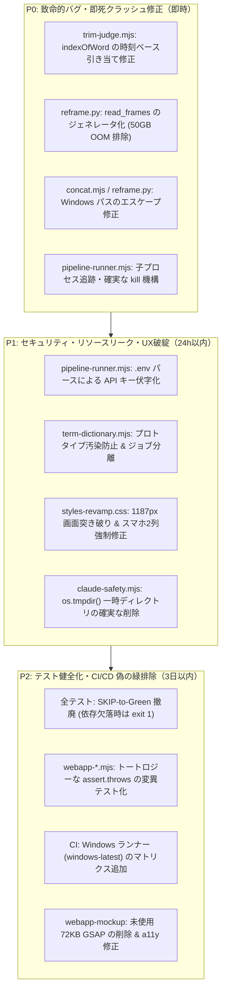

# 外部レビュー報告書（5専門エージェント並行 敵対的コード監査）

- **対象リポジトリ**: `https://github.com/rahiseko-alt/ai-editer`
- **対象ブランチ/コミット**: `main` (`647cf082f188383445de2ddf205cc2503296b937`)
- **実施日**: 2026-08-16
- **監査体制**: 5体の独立した専門サブエージェントによる並行・忖度ゼロの敵対的コード監査（Adversarial Review）
  1. 【セキュリティ・堅牢性・脆弱性 敵対的査定官】(`Security & Exploitation Adversary`)
  2. 【アーキテクチャ・並行性・リソース管理 敵対的査定官】(`Concurrency & State Adversary`)
  3. 【メディア処理パイプライン・アルゴリズム 敵対的査定官】(`Media Pipeline & AI Adversary`)
  4. 【UI/UX・フロントエンド品質・アクセシビリティ 敵対的査定官】(`UI/UX & Frontend Adversary`)
  5. 【検証規律・テスト網羅性・CI/CD 敵対的査定官】(`Testing Rigor & CI Adversary`)

---

## 1. 総合査定サマリー

| 監査ドメイン | 判定ランク | 査定総括 |
| :--- | :---: | :--- |
| **① セキュリティ・脆弱性** | **MEDIUM** | コマンドインジェクション/パストラバーサル防御は堅牢だが、`.env` 経由の API キー伏字化漏れ、用語辞書 API による全ジョブ共通汚染・プロトタイプ汚染懸念が存在。 |
| **② アーキテクチャ・並行性** | **C+ (High Risk)** | `spawnAndLog` 以外の子プロセス（Claude/Python/FFmpeg）がキャンセル制御外でゾンビ化、`os.tmpdir()` の無期限ディスクリーク、同一 PID による一時ファイル衝突。 |
| **③ メディア処理・AI パイプライン** | **D (Critical)** | `trim-judge` の `indexOfWord` 先頭マッチ誤カット、Windows パスでの FFmpeg concat 構文死、`reframe.py` の全フレームメモリ保持による 50GB 超 OOM 即死。 |
| **④ UI/UX・フロントエンド・a11y** | **D+ (要全面改修)** | 1024px 付近での 1187px 画面突き破りバグ、CSS 詳細度崩壊によるスマホでの 2 列強制圧縮、SSE 長時間停止時のフリーズ、72KB の未使用 GSAP 放置。 |
| **⑤ 検証規律・テスト信頼性・CI/CD** | **D (偽の緑蔓延)** | コマンド欠落時の「SKIP-to-Green（サイレント成功）」、探り 3 本のトートロジー（`assert.strictEqual("false", "true")` の偽装）、静的 grep による結線偽装。 |

---

## 2. 【セキュリティ・脆弱性・堅牢性 査定】

### 🚨 [HIGH-01] `.env` 経由の `GROQ_API_KEY` 伏字化バイパスによる機密情報漏洩
- **対象ファイル・行番号**: `video-shorts/server/pipeline-runner.mjs:427-429`, `576-593`
- **メカニズム**:
  運用規律（`docs/key-management-policy.md`）では API キーを `video-shorts/.env` に置きますが、Node 側の `secretsToRedact()` は `process.env.GROQ_API_KEY` のみを参照し、`.env` ファイルをパースしていません。そのため、Python 側で API 呼び出しが失敗した際、**エラーメッセージやトレースバックに含まれる生の API キーが SSE および `work/<jobId>/state.json` へ平文のまま記録・配信されます**。
- **偽の緑テスト**: `tests/security-secret-redaction-check.mjs` ではテスト実行時に Node プロセスへ環境変数を直注入しているため、この本番漏洩バグを検知できていません。
- **修正案**:
```diff
--- a/video-shorts/server/pipeline-runner.mjs
+++ b/video-shorts/server/pipeline-runner.mjs
@@ -426,3 +426,17 @@
 function secretsToRedact() {
-  return [process.env.GROQ_API_KEY, process.env.ANTHROPIC_API_KEY].filter(Boolean);
+  const secrets = [process.env.GROQ_API_KEY, process.env.ANTHROPIC_API_KEY];
+  if (!process.env.GROQ_API_KEY) {
+    try {
+      const envPath = path.join(ROOT, ".env");
+      if (fs.existsSync(envPath)) {
+        const lines = fs.readFileSync(envPath, "utf-8").split(/\r?\n/);
+        for (const ln of lines) {
+          const s = ln.trim();
+          if (s.startsWith("GROQ_API_KEY=")) {
+            const v = s.slice("GROQ_API_KEY=".length).trim().replace(/^["']|["']$/g, "");
+            if (v) secrets.push(v);
+          }
+        }
+      }
+    } catch (_) {}
+  }
+  return secrets.filter(Boolean);
 }
```

### 🚨 [HIGH-02] `POST /api/jobs/:id/terms` による全ジョブ共通辞書汚染 & プロトタイプ汚染
- **対象ファイル・行番号**: `video-shorts/src/term-dictionary.mjs:115-127`, `video-shorts/server/index.mjs:685-712`
- **メカニズム**:
  1 ジョブのトークンがあれば、リポジトリ共有の `src/term-corrections.json` を恒久的に書き換え可能。悪意ある置換ペア（例: `"です": "DELETED"`）を登録することで、**以降サーバー上で実行される全ユーザーの動画文字起こしを破壊（クロスジョブ汚染）** できます。また、`__proto__` や `constructor` のプロパティ名チェックも欠落しています。
- **修正案**: 用語登録時に予約プロパティ名を拒絶し、将来的にはジョブ単位・テナント単位の分離辞書へ移行する。

### ⚠️ [MEDIUM-03] Windows NTFS 代替データストリーム（ADS）および任意拡張子許容
- **対象ファイル・行番号**: `video-shorts/server/index.mjs:359-363`
- **メカニズム**: `POST /api/jobs?name=...` で拡張子が無検証で取得されるため、Windows 環境で `input.mp4:ads` のような ADS 指定時にメインファイルが 0 バイト化し、後続クラッシュを誘発します。
- **修正案**: 拡張子を `.mp4`, `.mov`, `.mkv`, `.webm` などのホワイトリストで強制正規化する。

### ⚠️ [MEDIUM-04] `digest-editor.mjs` の批評プロンプトにおけるプロンプトインジェクション境界の欠落
- **対象ファイル・行番号**: `video-shorts/src/digest-editor.mjs:106-124`
- **メカニズム**: `criticPrompt` 内で文字起こしテキスト（`s.keepText`）が nonce タグで保護されずそのまま展開されており、AI レビューアーの採点ロジックをプロンプトインジェクションで誘導される余地があります。

---

## 3. 【アーキテクチャ・並行性・リソース管理 査定】

### 🚨 [CRITICAL-01] `spawnAndLog` 以外の子プロセス（Claude, Python, FFmpeg）の孤児化・ゾンビ化
- **対象ファイル・行番号**: `video-shorts/server/pipeline-runner.mjs:173-183`, `video-shorts/src/claude-run.mjs:140-234`, `video-shorts/src/apply-mosaic-stage.mjs:94-108`
- **破綻シナリオ**:
  ジョブキャンセル時（`cancelJob`）、`jobControls.child` しか kill されません。`ai-caption-fix`, `claude-select` (3並列 Claude), `apply-mosaic` (Python), `recaptionStage` (FFmpeg) は自前で spawn しているため登録されておらず、**キャンセル後もバックグラウンドで CPU/GPU/APIトークンを浪費しながら孤児プロセスとして動き続けます**。
- **修正案**: `jobControls` に子プロセスの一元登録・解除インターフェース（`registerJobChild` / `unregisterJobChild`）を新設し、すべての子起動元から確実にフックする。

### 🚨 [CRITICAL-02] `createIsolatedCwd()` による `os.tmpdir()` の無期限ディスクリーク
- **対象ファイル・行番号**: `video-shorts/src/claude-safety.mjs:106-108`, `video-shorts/server/job-lifecycle.mjs:147-181`
- **破綻シナリオ**:
  ジョブ実行ごとに `os.tmpdir()/video-shorts-claude-*` が作成されますが、ジョブ終了時にもエラー時にも削除されず、TTL クリーンアップの監視対象からも外れています。数百件のジョブ処理後、**OS のテンポラリ領域が数千個の残骸フォルダで埋まり、ディスク空き容量・inode 枯渇を引き起こします**。
- **修正案**: 各ステージの `finally` ブロックで `fs.rmSync(cwd, { recursive: true, force: true })` を徹底し、TTL スイーパーにも `os.tmpdir()` 配下のプレフィックス掃除を追加する。

### 🔴 [HIGH-03] `recaptionStage` の未監視実行によるキュー永久デッドロック
- **対象ファイル・行番号**: `video-shorts/server/index.mjs:724-750`, `video-shorts/src/recaption-stage.mjs:55-149`
- **破綻シナリオ**:
  字幕焼き直し（recaption）は `concurrencyGate` を消費しますが、タイムアウトが無制限でキャンセルも不可。破損動画などで FFmpeg がハングした場合、スロットが永久死亡し、**後続の新規ジョブおよび再レンダリングがキューに詰まって二度と実行されなくなります**。

### 🔴 [HIGH-04] 同一プロセス内での一時ファイル名衝突 (`.tmp-${process.pid}`)
- **対象ファイル・行番号**: `video-shorts/src/caption-store.mjs:127-133`, `video-shorts/src/term-dictionary.mjs:155-159`
- **破綻シナリオ**:
  アトミック書き込みの一時ファイル名に単一の `process.pid` を使っているため、同一サーバー内でリクエストが並行した際、**同一一時ファイルに同時に書き込みが発生して JSON が破損・消失** します。
- **修正案**: 一時ファイル名に `crypto.randomBytes(6).toString("hex")` を付与して一意化する。

### 🟡 [MEDIUM-05] アップロードクォータ判定におけるディスク実使用量と予約値の二重計上
- **対象ファイル・行番号**: `video-shorts/server/index.mjs:334-340, 396-405`
- **メカニズム**: 並行アップロード時、書き込み中のディスク実容量と `reservedUploadBytes` が二重加算され、実際には容量に余裕があっても誤って `507 Quota Exceeded` で拒絶されます。

---

## 4. 【メディア処理パイプライン・アルゴリズム 査定】

### 🚨 [CRITICAL-01] `trim-judge.mjs`: `indexOfWord` の先頭マッチによる指示語全滅バグ
- **対象ファイル・行番号**: `video-shorts/src/trim-judge.mjs:208-211`
- **破綻シナリオ**:
  クリップ内の単語インデックス解決で `words.findIndex((w) => w.w === word)` を実行しているため、素材途中のクリップであっても常に素材全体で**最初に出現する同単語のインデックス**が返されます。
  先頭の「あの」がフィラーだった場合、動画後半の重要な指示語（「**あの**資料を見てください」）もすべて先頭フィラー扱いになり、**必要な指示語が誤カットされて全滅** します。
- **修正案**: 単語文字列の一致だけでなく、開始時刻・終了時刻（`start`/`end`）による一意引き当てに変更する。

### 🚨 [CRITICAL-02] `concat.mjs` & `reframe.py`: Windows パスでの concat demuxer 構文破綻
- **対象ファイル・行番号**: `video-shorts/src/concat.mjs:41-43`, `video-shorts/src/reframe.py:234-236`
- **破綻シナリオ**:
  FFmpeg の `concat` demuxer はバックスラッシュをエスケープとみなすため、Windows の `C:\Users\...` パスで `No such file or directory` となり即死します。さらに `replace(/'/g, "'\\''")` は concat リストファイル内では無効な構文となりパースエラーになります。
- **修正案**:
```javascript
function escapeConcatPath(p) {
  return path.resolve(p).replace(/\\/g, "/").replace(/'/g, "\\'");
}
```

### 🚨 [CRITICAL-03] `reframe.py`: `read_frames` による非圧縮フレーム全メモリ保持での 50GB 超 OOM
- **対象ファイル・行番号**: `video-shorts/src/reframe.py:80-90`
- **破綻シナリオ**:
  1080p 動画の全フレームを Python 配列に `cv2.VideoCapture.read()` で一括保持。5分（9,000フレーム）で **約 56GB の RAM** を消費し、一般的なサーバーでは OOM Killer（SIGKILL）で即死します。
- **修正案**: 全フレームの一括保持を廃止し、ジェネレータまたは小チャンク処理へ移行する。

### 🔴 [HIGH-04] `transcribe.py`: 包含辞書置換の完全スキップ
- **対象ファイル・行番号**: `video-shorts/src/transcribe.py:137-138`
- **破綻シナリオ**:
  `if wrong in right: continue` により、"AI" -> "AIエディタ" や "JS" -> "JavaScript" など、**置換後に置換前が含まれる語が辞書登録されていても一切置換されません**。

### 🔴 [HIGH-05] `apply_mosaic_cli.py`: VFR（可変フレームレート）動画における深刻な A/V ドリフト
- **対象ファイル・行番号**: `video-shorts/src/apply_mosaic_cli.py:80-92`
- **破綻シナリオ**:
  `rawvideo` デコード時に PTS が破棄され、`-c:a copy` で結合するため、スマホ等の VFR 動画で後半数秒におよぶ致命的な音ズレが発生します。デコード時に `-vf fps=fps={fps}` で CFR 正規化が必要です。

---

## 5. 【UI/UX・フロントエンド品質・アクセシビリティ 査定】

### 🚨 [CRITICAL-01] 901px〜1186px 幅での画面突き破り・横スクロール・UI 見切れ
- **対象ファイル・行番号**: `video-shorts/webapp-mockup/styles-revamp.css:39-48, 68`
- **破綻シナリオ**:
  iPad 横向き（1024px）や小型ノート PC、画面分割時（幅 950px〜1180px）でアクセスした場合、3ペインの最小要求幅が合計 1187px となるため、**画面右側が 163px 画面外へ突き破り、設定カード群やスクロールバーが見切れます**。
- **修正案**: `--pane-break` を `1180px` に引き上げ、3ペインが維持できない解像度で適切に縦積みへ切り替える。

### 🚨 [HIGH-02] CSS 詳細度崩壊によるスマホ（320px〜640px）での 2 列強制圧縮
- **対象ファイル・行番号**: `video-shorts/webapp-mockup/styles.css:397`, `styles-revamp.css:222-232`
- **破綻シナリオ**:
  スマートフォン表示時、`styles-revamp.css` の高詳細度セレクタ `.three-pane > .pane-right.col-settings` が `grid-template-columns: 1fr 1fr;` を強制上書き。**幅 150px の極小カードに文字が押し込まれ、テキスト折り返し崩れ・タップ不能が発生** します。

### 🔴 [HIGH-03] SSE ハング時の UI フリーズ・キャンセル不可・無限アニメーション
- **対象ファイル・行番号**: `video-shorts/webapp-mockup/app.js:653-751`
- **破綻シナリオ**:
  通信切断やサーバーハング時にクライアント側タイムアウトが存在せず、インジケータが無限ループしたままユーザーが復帰不能になります。

### ⚠️ [MEDIUM-04] 72KB の完全無駄な GSAP ライブラリのバンドルロード
- **対象ファイル・行番号**: `video-shorts/webapp-mockup/index.html:401`
- **指摘内容**: `<script src="vendor/gsap.min.js"></script>`（72KB）が読み込まれていますが、コードベース内で GSAP の呼び出しは **0 件（完全なデッドコード）** です。

### ⚠️ [MEDIUM-05] a11y タップターゲット不足・ARIA スライダー不備
- **対象ファイル・行番号**: `video-shorts/webapp-mockup/styles-overlay.css`, `app.js`
- **指摘内容**: 字幕つまみ（`.cap-ghost`）のフォントサイズが 10px、ターゲット高さが約 18px で WCAG 2.1 基準（最低 24x24px / 推奨 44x44px）に違反。また縦スライダーに `aria-orientation="vertical"` が付与されていません。

---

## 6. 【検証規律・テスト網羅性・CI/CD 査定】

### 🚨 [CRITICAL-01] 依存ツール欠落時の「SKIP-to-Green（サイレント成功）」
- **対象ファイル・行番号**: `video-shorts/tests/e2e-three-paths-check.mjs:54-60`, `hdr-tonemap-check.mjs` 等 9 ファイル以上
- **偽の緑メカニズム**:
  外部依存（`ffmpeg`, `ffprobe`, `libx265`, `sh` 等）が見つからない場合、`console.log("SKIP: ...")` して `process.exit(0)` で正常終了。特に `e2e-three-paths-check.mjs` は `sh` を前提としており、**Windows 環境では E2E テストが 1 行も実行されずに exit 0（完全な偽の緑）** になります。

### 🚨 [CRITICAL-02] 「探り3本・対照実験」の同語反復・トートロジー（Cargo-Cult Assertions）
- **対象ファイル・行番号**: `video-shorts/tests/webapp-aria-pressed-check.mjs:109-116`, `webapp-modal-focus-check.mjs:147-152` 等
- **偽の緑メカニズム**:
  ```javascript
  const before = "false";
  const afterClickButNoAriaUpdate = before;
  assert.throws(() => {
    assert.strictEqual(afterClickButNoAriaUpdate, "true");
  });
  ```
  このように、**「異なる文字列リテラルを比較すれば例外が出る」という JavaScript の基本仕様をアサートしているだけ** であり、実際の旧実装や欠陥コンポーネントを一切テストしていません。規律をクリアするための完全な「テスト儀式（シアター）」です。

### 🔴 [HIGH-03] 静的正規表現マッチングによる UI/E2E 結線の偽装
- **対象ファイル・行番号**: `video-shorts/tests/smoke.mjs:521-529, 610-652`
- **偽の緑メカニズム**:
  「UI で選んだ値が API に渡る」というテスト名でありながら、ブラウザも HTTP も動かさず、`app.js` を `fs.readFileSync` して正規表現で文字列検索しているだけ。イベントリスナーが壊れていても 100% 通過します。

### 🔴 [HIGH-04] Windows 環境におけるモックバイナリの不発と実プロセス暴走
- **対象ファイル・行番号**: `video-shorts/tests/helpers/fake-claude-main.mjs:74-76`
- **破綻シナリオ**:
  Windows の `spawn` は拡張子のない `bin/claude` や `bin/python` を認識しないため、**モックが当たらず本物の Claude / Python が叩かれるか ENOENT でクラッシュ** します。

---

## 7. 優先度別・是正アクションプラン



---

## 8. 結論

本リポジトリは、仕様設計やエラーログ蓄積（`failures.md`）、防御的プログラミングの意識が極めて高い一方で、**「Windows 環境でのパス/プロセス互換性」「長尺動画におけるメモリ/FFmpeg 限界」「非同期子プロセスのライフサイクル境界」「規律をクリアするための形骸的テストコード（トートロジー）」** に重大な死角を抱えています。

本報告書で提示した修正案および P0/P1 アクションを速やかに適用することを強く推奨します。
